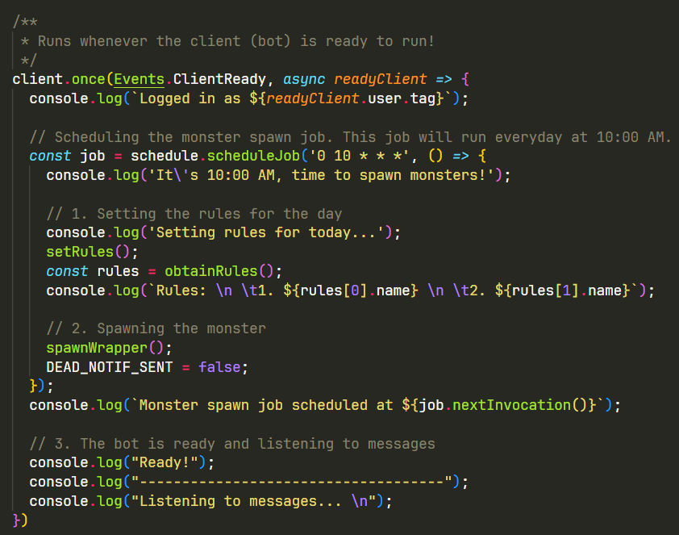
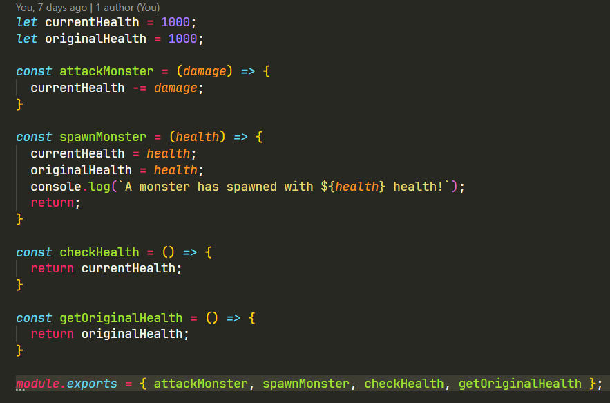
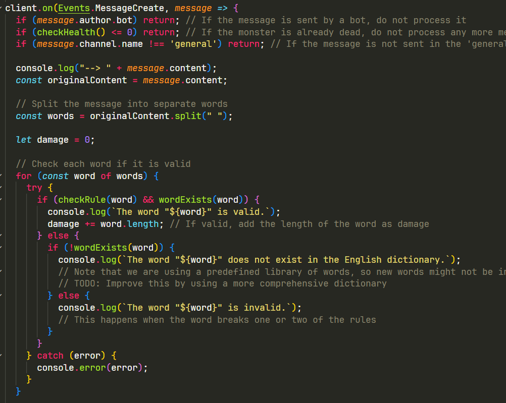
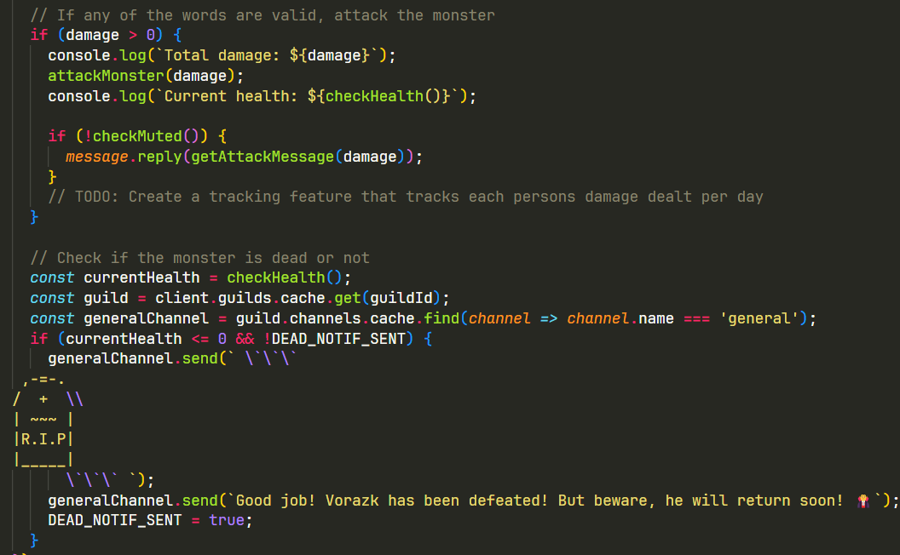
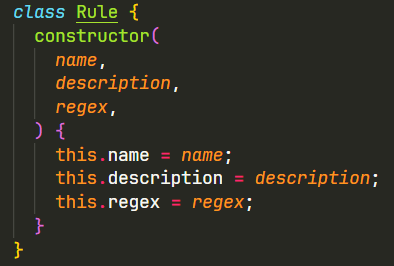
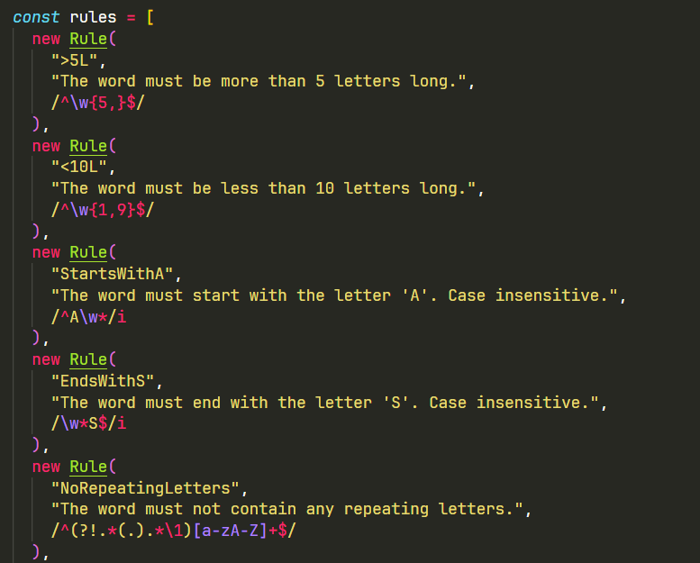
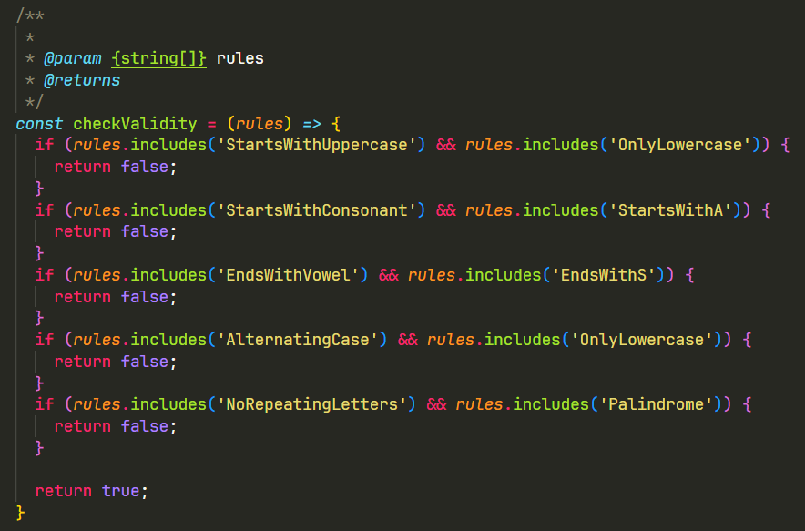
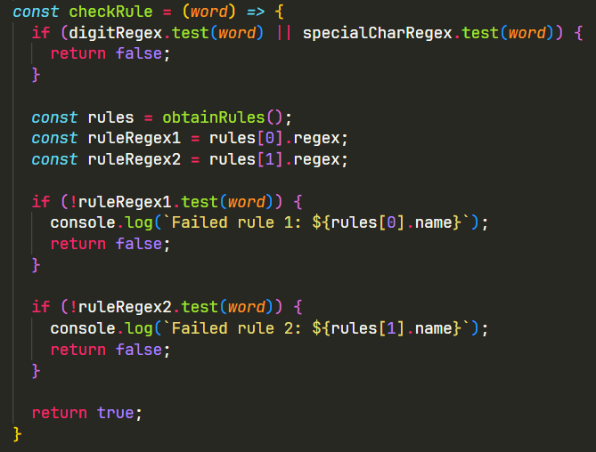

# discord-bot

Yo! Welcome to the vocabulary-enhancing bot! This discord bot aims to enhance users' vocabulary by gamifiying this experience. The basic idea is that each day, new rules are placed. These rules indicate what words are considered 'valid' for the day!

## HOW IT WORKS
This discord bot is based on the `discord.js` library. Feel free to do your own research to find out more about `discord.js` via this link: https://discord.js.org/ 

### General Overview
This bot mainly focuses on listening to users' messages and running logic on each word. The main plot of the bot is that each day, a new monster is spawned and users must type words that meet the criteria to defeat the monster. These valid words are considered as attacks. Rules change everyday and monsters will become stronger as more people join the server.

### Slash Commands
Aside from reading in messages, this discord bot also has a few built in slash commands. They are:

- `echo.js`           -> Takes in a string input and replies with whatever is given
- `help.js`           -> Prints out the lore and how to play the game
- `monsterDetails.js` -> Replies with the monster's current health, progress and the monster's lore
- `mute.js`           -> Stops the bot from sending succesful attack messages
- `unmute.js`         -> Allows the bot to send succesful attack messages
- `viewRules.js`      -> View the rules for today

### Explaining the Logic
**Spawning the Monster**
The logic for spawning the monster is a function called `spawnWrapper` in file `index.js`. The spawning functionality is engraved within a job object, this allows the bot to repeat the spawning functionality everyday at a specialised time. This job object is then defined when the bot is ready. When the bot starts, it defines the job. This is done so that the job object is defined only once and that repitition is mitigated.

Spawning the monster itself is actually quite easy. To make things simple, the monster only has a health bar and no other modifiers. To make the code simpler, all functionalities regarding the monster is placed in `monster.js`. Attacking the monster is basically subtracting damage from its current health.

**Reading and Evaluating Messages**
Another function is declared to read and evaluate incoming messages. The logic for reading and evaluating messages can be found in `index.js` starting from line 155 to 216. At the beginning, we do some preliminary checks. 

1. The message must not originate from the bot itself
2. The message must originate from the general channel
3. The monster must still be alive

Once all these criterias are met, the bot can finally begin processing the words. Immediately, the message is broken down into words. Then, each word is validated individually. This validation process involves invoking the `checkRule()` and `wordExists()` function. Which compares the word with the rules of the day and whether the word exists in the English dictionary or not.

If valid, the word's length is then converted into damage. 1 letter = 1 damage. Once all the words have been evaluated, the monster is attacked with the corresponding damage. If this kills the monster, a kill message will be sent to the player.

**Creating the Rules**
Functions regarding the rules and the rules themselves are all listed in `rules.js`. Rules by nature are defined as a regex string. Which is basically pattern matching. Each Rule object contains a name, description and the regex itself. To construct your own regex strings and rules, you can actually use ChatGPT (they do a solid job of this) or trying out something like https://regexr.com/. 

However, some rules do overlap and may result in conflicting requirements. To account for this, I hard coded some restrictions.

Rules are set each day through a randomiser. This randomiser selects two random rules everyday. Rules cannot be duplicate, meaning that each day there are 2 different rules.

**Enforcing the Rules**
Funny enough, the actual function to check whether a word passes the rules or not are actually placed in `service.js`. The function to evaluate words is called `checkRule()`. They first check if the words contain numbers or special characters. If the word does not contain any of these, the function will move on to evaluating the actual rules. If the word passes both rules, the function returns `true` and `false` otherwise.

