# Welcome to bot development with Discord! 😋

In this tutorial we'll go over how to setup, invite and run some basic commands on your very own discord bot.

## What is Discord?

Discord is a chatting app like instagram or messenger where you can create servers and groups to talk with others! 

### Setting up Discord

To make a discord bot, you will first need to make a discord account for your discord bot, which can be done [here](https://discord.com/register) if you don't have one already. You can then access discord via the web version, or download the app onto your device.

Once you've gotten setup, find a group of around 4-5 people around you and get one person to make a new server for you and your discord bots. A server is basically like a group chat, but you can fit a lot more people into it. To create one,

1. Find the `+` button at the bottom of your server list on the very left.

2. Select `Create My Own` and `For me and my Friends`. Give it a name, and optionally a nice picture.

3. Once you're in the server, find the invite link by clicking on the downwards arrow on the server name and finding `Invite People` like so:

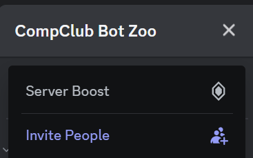

4. Send everyone in your group the invitation link!

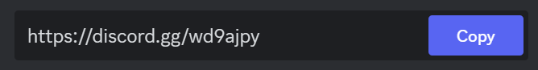

Once they follow it, you should see everyone join the server, with messages appearing in the `#general` channel.

### Roles

On a discord server, roles let you sort people into categories, and decide which groups of people you want to give permissions to.

Let's make an admin role to allow everyone to invite their own bots!

1. First, find `server settings` in the same dropdown that the invite link was in.
2. Find the `roles` tab on the options to the left!

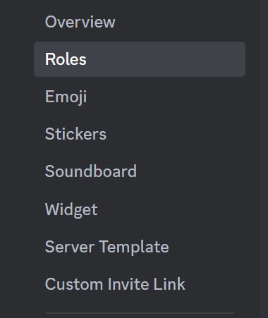

3. Create a new role, and scroll to the bottom of the `permissions` tab until you find `administrator`, and tick the button. Don't forget to save your changes!

4. Now look back on the bar to the left and find `members` near the bottom.

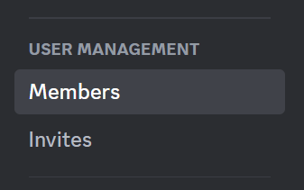

You will find a list of all the members of your server! Give everyone the role you just made by finding the `+` button next to their name.

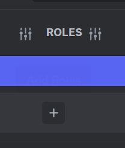

Awesome! you're all set to move onto the next step.

## What is a Discord bot?

A feature of Discord is that it allows us to use bots - these are automated helpers that help run commands for us if we ask them to.

For example, this is a bot I made to give me the latest image from the JWST gallery. By running a simple command, it fetches the image for me and delivers it in a nice little discord message!

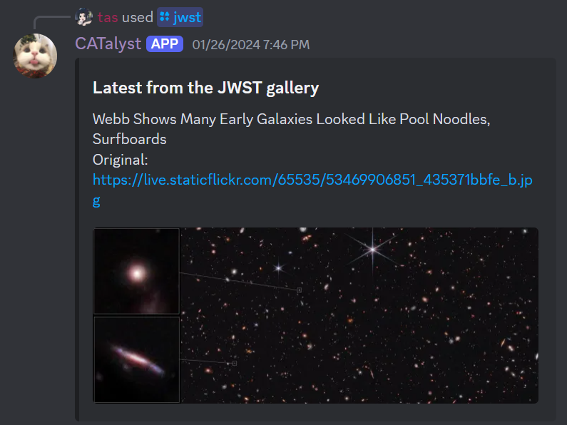

Let's go through setting up your own discord bot.

1. Click on your user settings in the bottom left, next to your user photo and click on `Advanced` in the sidebar. Then activate `Developer Mode`. This will let us have the right mode to build a bot.

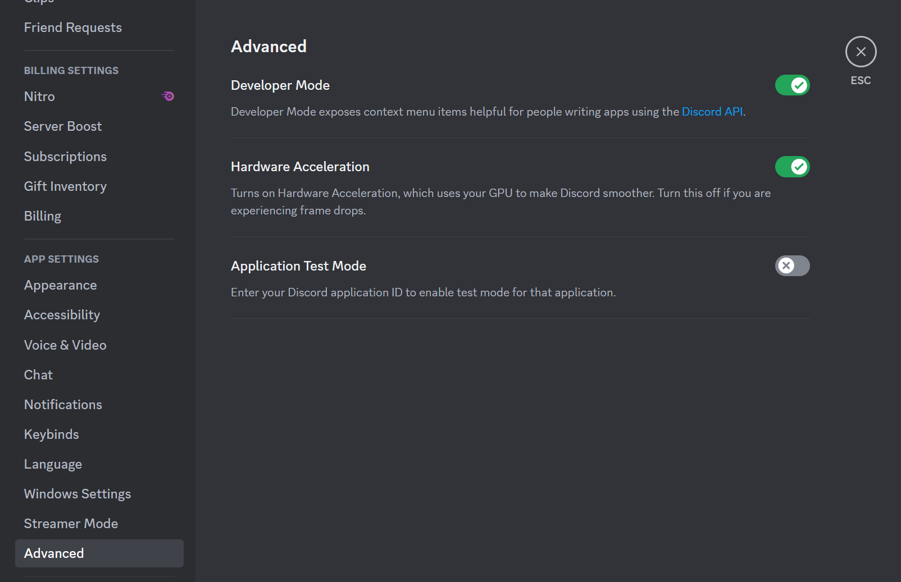

2. Follow the link to the [discord API](https://discord.com/developers/docs/intro) and login if needed.

3. Find the applications tab on the top left, and press `new application`. Create an application and give it a name.

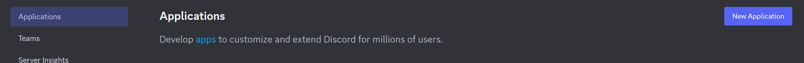

4. Click on `Bot` in the left sidebar, then click on `Add Bot` to create a bot account and bot token.

5. Once your bot is created, you can give it a username and a picture in the `Bot` tab.

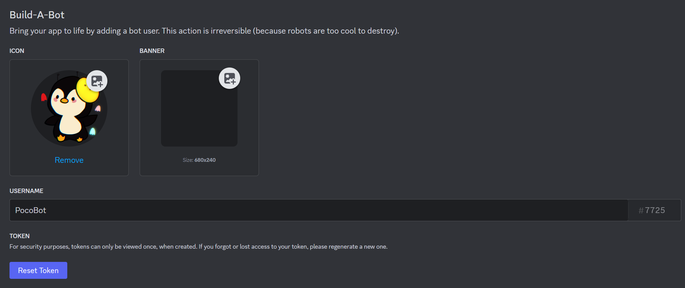

6. Go to the `OAuth2` tab and tick the following permissions:

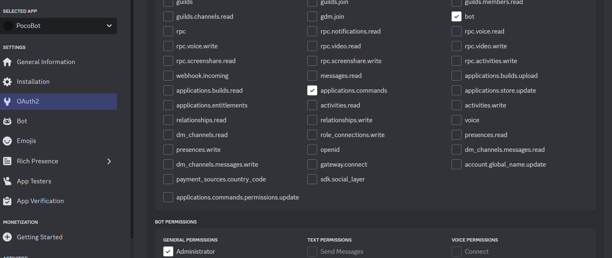

7. Copy the link below the permissions tables at the very bottom of the `OAuth2` page and paste it into your web browser!

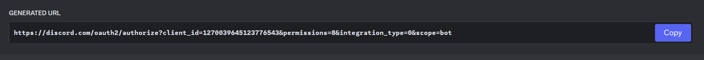

Select the server you made in the dropdown that shows to add your bot to the server.

You should see your bot join your server with a welcome message. We're done with actually making the bot! Yay!

## Adding code to our bot

TODO: give them a runnable script that just installs node.js (version - node v20.11 upwards but not v22), npm and discord.js

(note: if you're reading this as an instuctor then pls install all of these yourself hehe)

Let's take a look at the files we have in our project so far:

## `index.js`

The index is where our robot will first start working from. The code to setup your bot is mostly filled in for you.

## `deploy-commands.js`

Deploy-commands contains the script that your repo uses to register the commands added to your bot. We'll learn more about this file and what it does when we explore the *slash command builder*, but you can also leave this one untouched for now.

## `package-lock.json`, `package.json`, `.giitignore`, 

These are setup files in our folder! Don't worry about these (or change them).

## `config.json`

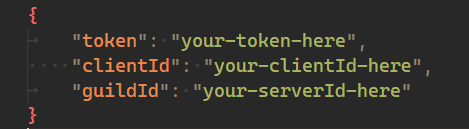

Your config file holds the specific information needed by **your** bot in particular. To fill in each field,

### `token`:

Navigate back to your bot application in the discord developer portal, and go to the `bot` tab. Scroll down until you see the `reset token` button; click this and it should give you your bot's token that you can copy into the config file.
- It's important to note that your token should be kept as private as possible! if you share your token, other people could add code to and access your discord bot. Make sure you only put it into your `config.json` file and nowhere else.

### `clientId`:

Navigate to `general information` on the discord developer portal, and copy the text listed as **Application ID**. Paste this into your config file.

### `guildId`:

Our coding interface refers to servers as 'guilds'. So, we need to pick which server we want our bot to be able to execute commands in. In your Discord app, right click the icon of the server you just made on the side. 

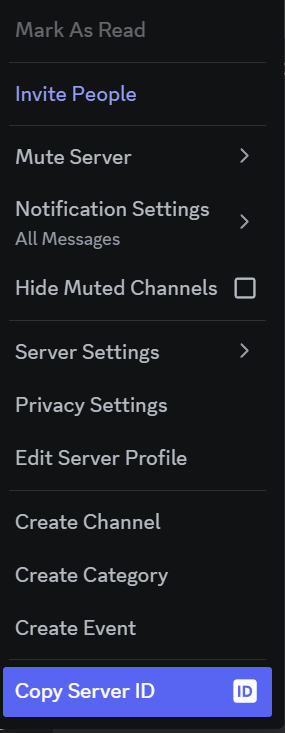

Click on `copy server id`, and then paste this into the guildid field in your config.json.

## Adding our first code

Now that we've linked our bot to our code using its token, we can try running it!

Everytime we want to run our bot, we have to start it by typing `node .` in our terminal. It's important to remember that whenever we add a new feature, we have to shut down the bot (by pressing `CTRL + C`) and start it again.

Press `CTRL + ~` on your keyboard to open the terminal, and type `node .` to start your bot! To verify if it started, you can go into your server and look at the *member list* on the right side - if your bot powered on successfully, it should display under the 'online' category. (It should also send you a message in the terminal of whatever coding app you're using).

Right now, our bot barely has any functionality! In fact, the only thing it can do is run a command called `ping`. To try it out, go into the `#general` chat of your server and type `/ping` in the message bar. Let's give it some more functionality!

